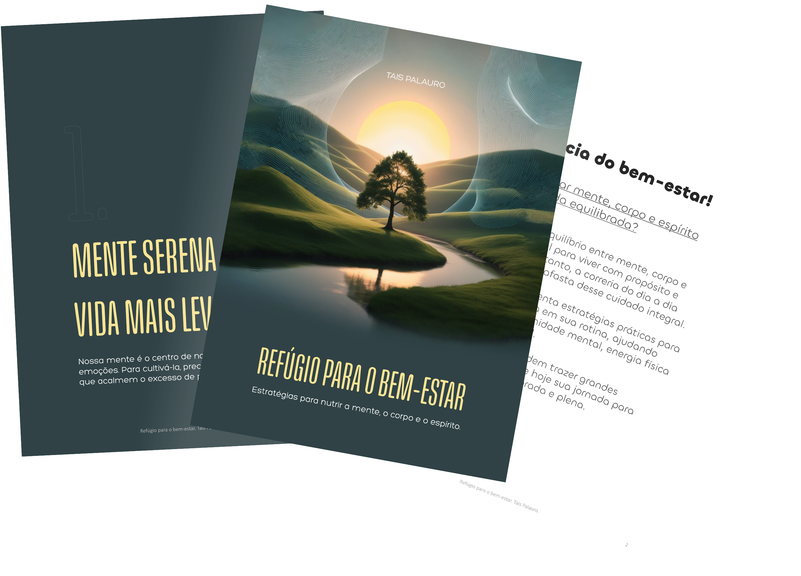

    

-------

# Projeto EBOOK Gerado por I.A.s

 > ℹ️ **NOTA:** Este é o repositório que desenvolvi como parte do curso realizado na plataforma da [DIO](https://dio.me)

Projeto com o objetivo de gerar um ebook digital com as facilidades das ferramentas de IA. todos os prompts
seguem abaixo.

<a href="https://github.com/TaisPalauro/prompts-recipe-to-create-a-ebook/blob/b5af290fc68583bd912cc2b349a05c288fcd82b9/output/Ebook%20Ref%C3%BAgio%20para%20o%20bem-estar.pdf" title="View PDF now"> 📕Clique aqui para ler</a>

## 💻 Tecnologias utilizadas no projeto

- [ChatGPT](https://chat.openai.com/) 
- [Leonardo.AI](https://app.leonardo.ai/)
- [PowerPoint](https://www.microsoft.com/en/microsoft-365/powerpoint)

## 🧠 Prompts

ChatGPT：

|   Ação   | prompt                                                                                                                                                                                                                                                                         |
| :------: | ------------------------------------------------------------------------------------------------------------------------------------------------------------------------------------------------------------------------------------------------------------------------------ |
|  título  | Crie um título de um ebook sobre o tema de Saúde e Bem-Estar, o ebook é do nicho de autoajuda e o subnicho é de bem-estar emocional, o título deve ser épico e curto, e tenha uma temática mais afetuosa, me cite 5 variações de títulos.                                      |
| conteúdo | Faça um texto para ebook, com foco em saúde e bem-estar, estratégias para nutrir a mente, o corpo e o espírito. {REGRAS} Explique sempre de uma maneira simples. Deixe o texto enxuto. Sempre traga exemplo em contextos reais. Sempre deixe um título sugestivo por tópico.   |

Midjourney：

|  Ação  | prompt                                                                                 |
| :----: | -------------------------------------------------------------------------------------- |
| título | A jedi in meditation pose, with your blue lightsaber floating, pixel art style --v 5.1 |

## ✨ Features

- Conteúdo gerado via ChatGPT
- Imagens geradas via MidJourney

## 📚 Materiais

- Imagens utilizadas em `assets`
- ebook gerado durante as aulas em `output`

## 🛠️ Instruções de execução

Utilize os prompts acima nas ferramentas sugeridas para gerar o material base e utilize uma ferramenta de edição de documentos como power point, libreoffice , indesign para diagramação.

## 👨‍💻 Expert

    
    
&nbsp&nbsp&nbspFelipe Aguiar 
    &nbsp&nbsp&nbsp
    <a href="https://github.com/felipeAguiarCode">
    GitHub</a>&nbsp;|&nbsp;
    <a href="www.linkedin.com/in/
felipe-exe">LinkedIn</a>
&nbsp;|&nbsp;
    <a href="https://www.instagram.com/felipeaguiar.exe/">
    Instagram</a>
&nbsp;|&nbsp;

  

---

⌨️ com 💜 por [Felipe Aguiar](https://github.com/felipeAguiarCode)
